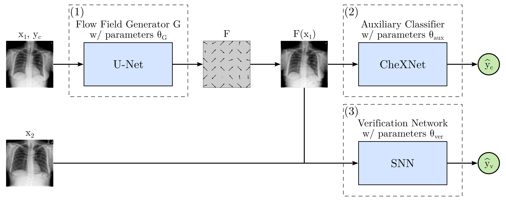

# PriCheXy-Net

## Overview
This repository provides code to the paper **"Deep Learning-Based Anonymization of Chest Radiographs: A Utility-Preserving 
Measure for Patient Privacy"** (accepted at MICCAI 2023).

In this work, we proposed PriCheXy-Net &mdash; an adversarial image anonymization architecture for chest radiographs 
(see below). The model is a composition of three independent neural networks that, when collectively used, allow for 
learning a deformation field that is able to impede patient re-identification.

<figure>
    
</figure>

## Requirements
All our experiments have been conducted using: 
* Python (3.9.5)
* PyTorch (1.10.2)

A list of required packages can be found in ```requirements.txt```.

## Usage instructions

### 1. Pre-training of the flow field generator
Set the experiment configuration in `./config_files/config_pretrain.json`. The most important parameters are:
* "generator_type": Either "flow_field" (ours) or "privacy_net".
* "mu": The deformation degree, e.g. 0.01.

Execute the pre-training by running the following command:

```
python3 pretrain_generator.py --config_path ./config_files/ --config config_pretrain.json
```

Note that we already provide the pre-trained models in folder `./networks/`.

### 2. Training of PriCheXy-Net
Set the experiment configuration in `./config_files/config_anonymization.json`. The most important parameters are:
* "ac_loss_weight": Set to 1 for all our experiments.
* "ver_loss_weight": Set to 1 for all our experiments.
* "generator_type": Either "flow_field" (ours) or "privacy_net".
* "mu": The deformation degree, e.g. 0.01.

Execute the complete training by running the following command:

```
python3 train_architecture.py --config_path ./config_files/ --config config_anonymization.json
```

Note that we provide the trained models in folder `./networks/`.

### 3. Re-training and evaluation of the verification model
Set the experiment configuration in `./config_files/config_retrainSNN.json`. The most important parameters are:
* "perturbation_type": Either "flow_field" (ours), "privacy_net", "dp_pix" or "none".
* "perturbation_model_file": The perturbation model, e.g. "./networks/generator_lowest_total_loss_mu_0.01.pth".
* "mu": The deformation degree, e.g. 0.01.
* "b": The pixelization grid size, e.g. 8. Only needed for "dp_pix".
* "m": Set to 1 for our experiments. Only needed for "dp_pix".
* "eps": Set to 0.1 for our experiments. Only needed for "dp_pix".

To assess the anonymization capability, run the following command:

```
python3 retrain_SNN.py --config_path ./config_files/ --config config_retrainSNN.json
```

Note that this script only performs one training and testing run of the SNN! In our paper, however, we report the 
verification performance (AUC (mean +- std)) over 10 independent training/testing runs. If this experiment is conducted 
multiple times, one can compute the average verification performance using the function ```compute_meanAUC()``` in 
```./utils/utils.py```.

### 4. Evaluation of the classification model on anonymized data
Set the experiment configuration in `./config_files/config_eval_classifier.json`. The most important parameters are:
* "perturbation_type": Either "flow_field" (ours), "privacy_net", "dp_pix" or "none".
* "perturbation_model_file": The perturbation model, e.g. "./networks/generator_lowest_total_loss_mu_0.01.pth".
* "mu": The deformation degree, e.g. 0.01.
* "b": The pixelization grid size, e.g. 8. Only needed for "dp_pix".
* "m": Set to 1 for our experiments. Only needed for "dp_pix".
* "eps": Set to 0.1 for our experiments. Only needed for "dp_pix".

To assess data utility on a downstream classification task, run the following command:

```
python3 eval_classifier.py --config_path ./config_files/ --config config_eval_classifier.json
```

To compute the 95% confidence intervals (1000 bootstrap runs), use the function ```bootstrap_abnormalities()``` in 
```./utils/utils.py```.
